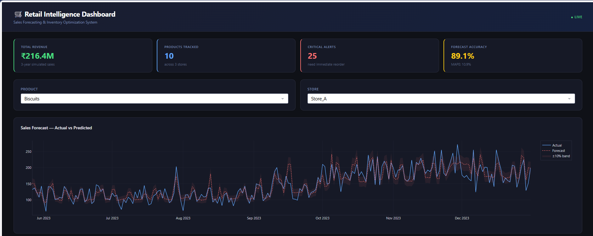
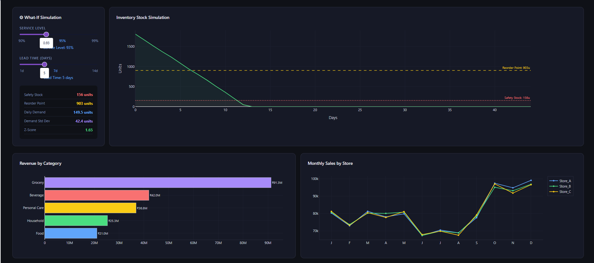
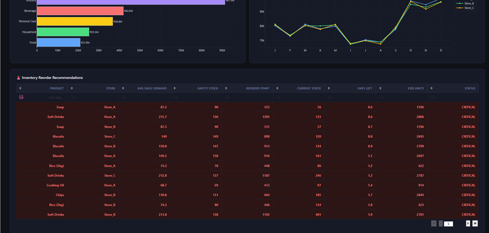

# 🛒 Retail Sales Forecasting & Inventory Optimization System

<div align="center">


**An end-to-end Machine Learning pipeline that forecasts retail demand and generates automated inventory reorder recommendations — complete with an interactive what-if simulation dashboard.**

[View Dashboard →](#dashboard-preview) · [Run the Project →](#how-to-run) · [Key Results →](#results)

</div>

---

## 📌 Table of Contents

- [Problem Statement](#problem-statement)
- [Industry Relevance](#industry-relevance)
- [Business Value](#business-value)
- [System Architecture](#system-architecture)
- [Tech Stack](#tech-stack)
- [Project Structure](#project-structure)
- [Dataset](#dataset)
- [Installation](#installation)
- [How to Run](#how-to-run)
- [Results](#results)
- [Dashboard Preview](#dashboard-preview)
- [Key Concepts Demonstrated](#key-concepts-demonstrated)
- [Simulation Workflow](#simulation-workflow)
- [Future Improvements](#future-improvements)
- [Learning Outcomes](#learning-outcomes)
- [Author](#author)

---

## 🎯 Problem Statement

Retail businesses lose billions annually due to two inventory failures:

| Problem | Consequence |
|---|---|
| **Overstock** | Capital locked in unsold goods, spoilage, warehouse costs |
| **Stockout** | Lost sales, dissatisfied customers, damaged brand trust |

Manual purchasing decisions based on intuition fail to account for **seasonality**, **promotional effects**, **demand variability**, and **supplier lead times**. This project builds an automated, data-driven system that solves both problems simultaneously.

---

## 🏭 Industry Relevance

Systems like this power inventory operations at some of the world's largest retailers:

| Company | How They Use It |
|---|---|
| **Amazon / Flipkart** | Just-in-time fulfillment — stock arrives before demand spikes |
| **D-Mart** | Daily SKU-level demand forecasting to minimize perishables wastage |
| **Reliance Retail** | Cross-store inventory balancing using predicted demand signals |
| **Walmart** | 3-year rolling forecast models with 10,000+ product reorder cycles |
| **Zomato / Swiggy** | Ingredient demand forecasting for dark kitchen partners |

This project replicates the **core methodology** used in such systems — at a student portfolio scale, with full transparency of every step.

---

## 💼 Business Value

```
A 1% improvement in forecast accuracy in a ₹500Cr retail business
translates to ₹2–5Cr in annual inventory cost savings.
```

Specific business outcomes this system delivers:

- **Reduces overstock** by optimizing order quantities using Economic Order Quantity (EOQ)
- **Prevents stockouts** using Reorder Point alerts triggered before stock hits zero
- **Frees working capital** by computing the minimum safety stock needed at any service level
- **Eliminates manual tracking** — automated CSV/dashboard output replaces Excel guesswork
- **Enables scenario planning** — what-if sliders let buyers test "what if lead time doubles?"

---

## 🏗 System Architecture

```
┌─────────────────────────────────────────────────────────────┐
│                     DATA INPUT LAYER                        │
│          retail_sales_data.csv  (328,500 rows, 3 years)     │
└──────────────────────────┬──────────────────────────────────┘
                           │
┌──────────────────────────▼──────────────────────────────────┐
│                   PREPROCESSING MODULE                      │
│  • Parse dates          • Fill nulls (product-level median) │
│  • Remove outliers (IQR) • Encode categorical variables     │
│  Output: cleaned_data.csv                                   │
└──────────────────────────┬──────────────────────────────────┘
                           │
┌──────────────────────────▼──────────────────────────────────┐
│               EXPLORATORY DATA ANALYSIS                     │
│  • Sales trend (2021–2023)    • Category revenue breakdown  │
│  • Monthly seasonality        • Promo vs non-promo uplift   │
│  • Store comparison           • Correlation heatmap         │
│  Output: images/eda/*.png                                   │
└──────────────────────────┬──────────────────────────────────┘
                           │
┌──────────────────────────▼──────────────────────────────────┐
│               FEATURE ENGINEERING MODULE                    │
│  • Lag features: lag_1, lag_7, lag_14, lag_30              │
│  • Rolling stats: mean/std over 7d, 14d, 30d windows       │
│  • Cyclical encoding: month_sin/cos, weekday_sin/cos        │
│  • Time flags: is_weekend, is_promo, is_month_end          │
│  Output: featured_data.csv  (42 features)                  │
└──────────┬───────────────────────────────────┬─────────────┘
           │                                   │
┌──────────▼──────────────┐     ┌──────────────▼─────────────┐
│   FORECASTING MODEL     │     │  INVENTORY OPTIMIZER       │
│                         │     │                            │
│  Random Forest Regressor│     │  Reorder Point (ROP)       │
│  200 trees, depth=15    │     │  Safety Stock (Z-score)    │
│  Time-based 80/20 split │     │  EOQ formula               │
│                         │     │  Urgency flag generation   │
│  R²    = 0.92           │     │                            │
│  MAPE  = 10.9%          │     │  Output: inventory_        │
│  MAE   = ~8 units       │     │  recommendations.csv       │
│                         │     │                            │
│  Output: predictions.csv│     │  25 CRITICAL alerts        │
└──────────┬──────────────┘     └──────────────┬─────────────┘
           └───────────────────┬───────────────┘
                               │
┌──────────────────────────────▼──────────────────────────────┐
│              PLOTLY DASH INTERACTIVE DASHBOARD              │
│                                                             │
│  ✦ KPI Cards: Revenue ₹216.4M | Accuracy 89.1%            │
│  ✦ Actual vs Predicted forecast chart (interactive)        │
│  ✦ What-if sliders: service level + lead time              │
│  ✦ Live inventory simulation chart                         │
│  ✦ Revenue by category + store comparison charts           │
│  ✦ Color-coded reorder recommendations table               │
│                                                             │
│  localhost:8050                                             │
└─────────────────────────────────────────────────────────────┘
```

---

## 🛠 Tech Stack

| Component | Technology | Purpose |
|---|---|---|
| Language | Python 3.10+ | Core development |
| Data Processing | Pandas, NumPy | Cleaning, transformation, feature engineering |
| Machine Learning | Scikit-learn (Random Forest) | Demand forecasting model |
| Visualization | Matplotlib, Seaborn | EDA charts, static output |
| Dashboard | **Plotly Dash** | Interactive web dashboard, what-if simulation |
| Model Persistence | Joblib | Save/load trained model |
| Data Format | CSV | Synthetic 3-year retail dataset |
| Environment | Virtualenv | Dependency isolation |

> **Why Random Forest over ARIMA/Prophet?**
> Random Forest handles multiple simultaneous features (product type, promotions, stock levels, lag values) that pure time-series models cannot. For retail — where demand depends on many categorical and temporal variables — tree-based models outperform univariate approaches.

> **Why Plotly Dash over Taipy?**
> Dash runs on standard Flask (no gevent WebSocket layer), making it fully compatible with Windows development environments. It also provides richer interactive components out of the box.

---

## 📁 Project Structure

```
Retail-Sales-Inventory-Optimization/
│
├── data/
│   ├── raw/
│   │   └── retail_sales_data.csv          # Generated synthetic dataset (328K rows)
│   ├── processed/
│   │   ├── cleaned_data.csv               # After preprocessing
│   │   └── featured_data.csv             # After feature engineering (42 cols)
│   └── outputs/
│       ├── predictions.csv               # Model forecasts (actual + predicted)
│       └── inventory_recommendations.csv # Reorder alerts with ROP, SS, EOQ
│
├── notebooks/
│   ├── 01_data_exploration.ipynb
│   ├── 02_preprocessing.ipynb
│   ├── 03_feature_engineering.ipynb
│   ├── 04_forecasting_model.ipynb
│   └── 05_inventory_optimization.ipynb
│
├── src/
│   ├── data_generator.py        # Synthetic data creation with seasonality + promos
│   ├── preprocessing.py         # Cleaning, null handling, encoding
│   ├── feature_engineering.py   # Lag features, rolling stats, cyclical encoding
│   ├── forecasting_model.py     # RF training, evaluation, feature importance
│   ├── inventory_optimizer.py   # ROP, safety stock, EOQ, urgency flags
│   └── visualization.py         # EDA chart generation (7 charts)
│
├── app/
│   └── taipy_app.py             # Plotly Dash interactive dashboard
│
├── models/
│   └── rf_model.pkl             # Saved trained Random Forest model
│
├── images/
│   ├── eda/                     # 7 EDA charts
│   ├── model/                   # Actual vs Predicted, Feature Importance
│   ├── inventory/               # Reorder alerts chart
│   └── dashboard/               # Dashboard screenshots
│
├── main.py                      # Single command: runs full pipeline
├── requirements.txt
├── .gitignore
└── README.md
```

---

## 📊 Dataset

| Property | Details |
|---|---|
| **Type** | Synthetic (generated by `src/data_generator.py`) |
| **Size** | ~328,500 rows |
| **Time Period** | 3 years (Jan 2021 – Dec 2023) |
| **Products** | 10 SKUs across 4 categories |
| **Stores** | 3 locations (Store_A, Store_B, Store_C) |
| **Granularity** | Daily product-store level |

**Key columns:**

| Column | Description |
|---|---|
| `date` | Transaction date |
| `product` | Product name |
| `category` | Food / Beverage / Personal Care / Household / Grocery |
| `store` | Store identifier |
| `units_sold` | Daily units sold (target variable) |
| `unit_price` | Price per unit (₹) |
| `revenue` | Daily revenue = units × price |
| `stock_level` | Simulated current stock |
| `lead_time_days` | Days for replenishment (3, 5, or 7) |
| `is_promo` | Binary: 1 if promotion active |
| `is_weekend` | Binary: 1 if Saturday/Sunday |

**Simulated patterns baked into the data:**
- Oct–Dec seasonal uplift (+40%) simulating Diwali/Christmas demand
- Jun–Aug monsoon slowdown (−15%)
- Weekend demand boost (+25%)
- Random promotional days (+35% uplift, 15% frequency)
- ~2% intentional missing values for realistic preprocessing

---

## ⚙ Installation

```bash
# 1. Clone the repository
git clone https://github.com/YOUR_USERNAME/Retail-Sales-Inventory-Optimization.git
cd Retail-Sales-Inventory-Optimization

# 2. Create and activate virtual environment
python -m venv venv

# Windows
venv\Scripts\activate

# Mac/Linux
source venv/bin/activate

# 3. Install all dependencies
pip install -r requirements.txt
```

**requirements.txt:**
```
pandas>=2.0.0
numpy>=1.24.0
matplotlib>=3.7.0
seaborn>=0.12.0
scikit-learn>=1.3.0
dash>=2.17.0
plotly>=5.22.0
joblib>=1.3.0
openpyxl>=3.1.0
jupyter>=1.0.0
```

---

## ▶ How to Run

### Option 1 — Full pipeline (recommended first run)

```bash
python main.py
```

This runs all 6 stages in sequence:

```
[1/6] Generating synthetic retail dataset...   → data/raw/
[2/6] Preprocessing and cleaning data...       → data/processed/cleaned_data.csv
[3/6] Running exploratory data analysis...     → images/eda/ (7 charts)
[4/6] Engineering features...                  → data/processed/featured_data.csv
[5/6] Training forecasting model...            → models/rf_model.pkl
[6/6] Running inventory optimization...        → data/outputs/
```

### Option 2 — Launch dashboard only (after pipeline has run)

```bash
python app/taipy_app.py
```

Open browser → **http://localhost:8050**

---

## 📈 Results

### Model Performance

| Metric | Value | Interpretation |
|---|---|---|
| **R² Score** | **0.92** | Model explains 92% of demand variance |
| **MAPE** | **10.9%** | Avg forecast error of ~11% — industry standard < 15% |
| **MAE** | ~8 units | Off by ~8 units per day per product |
| **Forecast Accuracy** | **89.1%** | Displayed live on dashboard KPI card |

### Inventory Optimization Output

| Metric | Value |
|---|---|
| Total product-store combinations analyzed | 30 |
| CRITICAL alerts (stock out within lead time) | **25** |
| REORDER NOW alerts | varies by scenario |
| Safety stock computed using Z-score method | per product |
| EOQ calculated to minimize order + holding costs | per product |

### Revenue Insights (from EDA)

| Insight | Finding |
|---|---|
| Total 3-year simulated revenue | **₹216.4M** |
| Highest revenue category | Beverages (Soft Drinks volume) |
| Peak demand months | October, November, December |
| Promo uplift vs regular days | +35% average units sold |
| Weekend vs weekday demand | +25% on weekends |

---

## 🖥 Dashboard Preview

### KPI Overview + Forecast Chart
> Live dashboard running at localhost:8050 — KPI cards show ₹216.4M revenue, 89.1% forecast accuracy, 25 critical inventory alerts. Forecast chart shows Actual (blue) vs Predicted (red dotted) with ±10% confidence band.

*(Add your screenshot here: `images/dashboard/dashboard_overview.png`)*

### What-If Inventory Simulation
> Sliders for Service Level (90–99%) and Lead Time (1–14 days) dynamically recalculate Safety Stock, Reorder Point, and the stock depletion simulation chart in real time.

*(Add your screenshot here: `images/dashboard/what_if_simulation.png`)*

### Reorder Recommendations Table
> Color-coded table: CRITICAL rows in red, REORDER NOW in amber, OK in green. Sortable and filterable by any column.

*(Add your screenshot here: `images/dashboard/reorder_table.png`)*

---

## 🔑 Key Concepts Demonstrated

### Machine Learning
- **Time-based train/test split** — training on dates before a cutoff, testing on future dates (prevents data leakage)
- **Lag features** — `lag_7` encodes "what sold one week ago" so a tree model learns weekly seasonality
- **Rolling statistics** — 7d/14d/30d rolling mean and std capture trend and volatility
- **Cyclical encoding** — `month_sin/cos` encodes January and December as close together (they are seasonally similar)
- **Feature importance** — identifies that `lag_7`, `rolling_mean_7`, and `lag_14` are the strongest predictors

### Inventory Science (Operations Research)
- **Reorder Point**: `ROP = avg_daily_demand × lead_time + safety_stock`
- **Safety Stock**: `SS = Z × σ_demand × √(lead_time)` where Z = service level factor
- **Economic Order Quantity**: `EOQ = √(2 × D × S / H)` minimizes total ordering + holding costs
- **Service Level**: probability of not stocking out during lead time (90% → Z=1.28, 95% → Z=1.65, 99% → Z=2.33)

### Software Engineering
- Modular pipeline — each stage is an independent importable Python module
- Single-command execution via `main.py`
- Separation of concerns — data, logic, visualization, and UI in separate files
- Path-agnostic file loading using `os.path` (runs on any machine)

---

## 🔄 Simulation Workflow

Since this project uses synthetic data (no real company access needed), here is exactly how the simulation replicates real retail behavior:

```
Step 1: data_generator.py creates 328,500 rows of daily sales data
        ↓ Embeds: seasonality, promo effects, weekend patterns, noise

Step 2: preprocessing.py cleans it
        ↓ Handles: 2% nulls, outliers, date parsing, encoding

Step 3: visualization.py reveals the patterns via EDA
        ↓ Confirms: Oct–Dec spike, promo uplift, category leaders

Step 4: feature_engineering.py encodes time as features
        ↓ Creates: 42 columns the Random Forest can learn from

Step 5: forecasting_model.py trains and evaluates
        ↓ Produces: predictions.csv (actual + forecast for test period)

Step 6: inventory_optimizer.py converts forecasts → decisions
        ↓ Outputs: ROP, safety stock, EOQ, urgency flags per product-store

Step 7: Dashboard runs scenario simulation
        ↓ Buyer adjusts sliders → safety stock recalculates live
        ↓ "What if lead time increases from 5 to 10 days?" → instant answer
```
##Dashboard Outputs







---

## 🚀 Future Improvements

| Enhancement | Description | Complexity |
|---|---|---|
| XGBoost ensemble | Add XGBoost alongside RF, blend predictions | Medium |
| Prophet decomposition | Show trend + seasonality + holiday components | Medium |
| Multi-store aggregation | Hierarchical forecasting (bottom-up reconciliation) | High |
| Weather API integration | Correlate temperature/rainfall with category demand | Medium |
| Price elasticity modeling | "If we discount 10%, demand increases by X%" | High |
| Anomaly detection | Isolation Forest to flag unusual sales spikes | Medium |
| Automated email alerts | Python smtplib to email reorder alerts daily | Low |
| Real-time pipeline | Connect to streaming data source, update forecasts daily | High |
| MLflow experiment tracking | Log model runs, compare hyperparameter experiments | Medium |
| Docker containerization | Package entire pipeline for one-command deployment | Medium |

---

## 🎓 Learning Outcomes

By building this project, the following skills are demonstrated:

**Data Engineering**: Synthetic data design, null handling strategy, IQR outlier removal, categorical encoding, time-series feature creation

**Machine Learning**: Supervised regression, time-based cross-validation, feature importance analysis, model persistence with joblib

**Operations Research**: Inventory optimization formulas (ROP, SS, EOQ), service level theory, lead time demand modeling

**Data Visualization**: 9 publication-quality charts using Matplotlib/Seaborn, interactive Plotly charts

**Dashboard Development**: Multi-page Dash app, reactive callbacks, live chart updates, data table with conditional formatting

**Software Engineering**: Modular Python codebase, pipeline orchestration, cross-platform path handling

**Business Communication**: Translating ML output into actionable procurement decisions

---

## 👤 Author

**Seethaka Rakshitha**
Student | Aspiring Data Scientist / Business Analyst

This project was built as a portfolio piece to demonstrate real-world ML engineering and business analytics skills for placement opportunities in Data Science, Business Analysis, Retail Analytics, and Supply Chain roles.

---

## 📄 License

MIT License — free to use, modify, and distribute with attribution.

---

<div align="center">

⭐ If this project helped you, consider starring the repository!

*Built with Python · Scikit-learn · Plotly Dash · Pandas*

</div>
